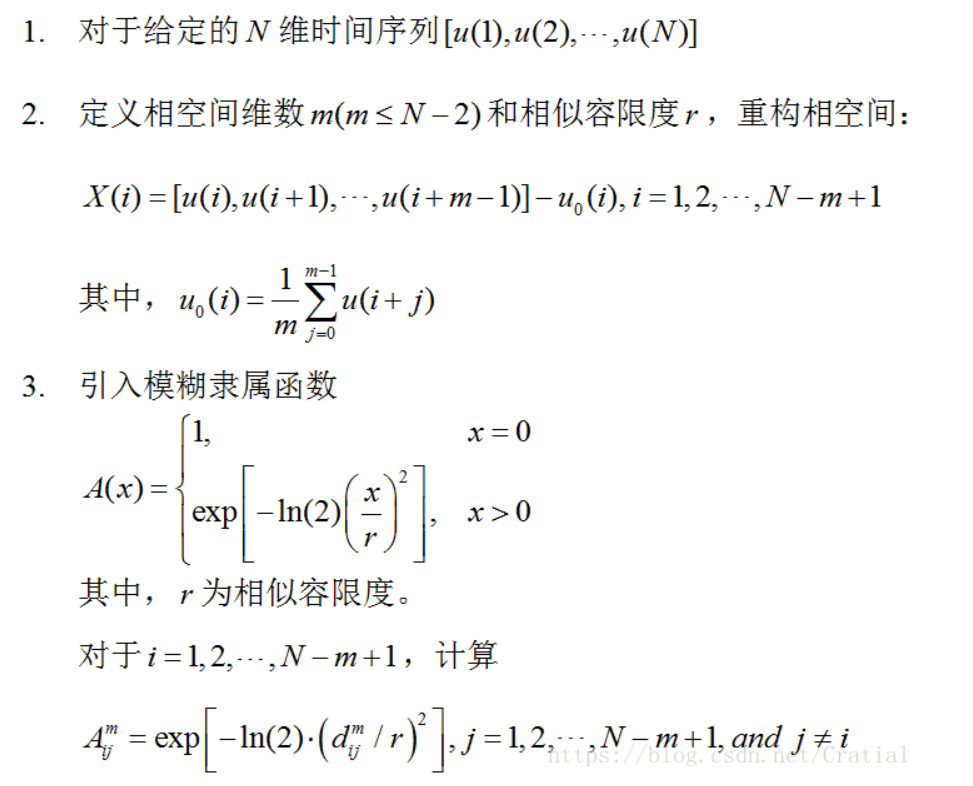
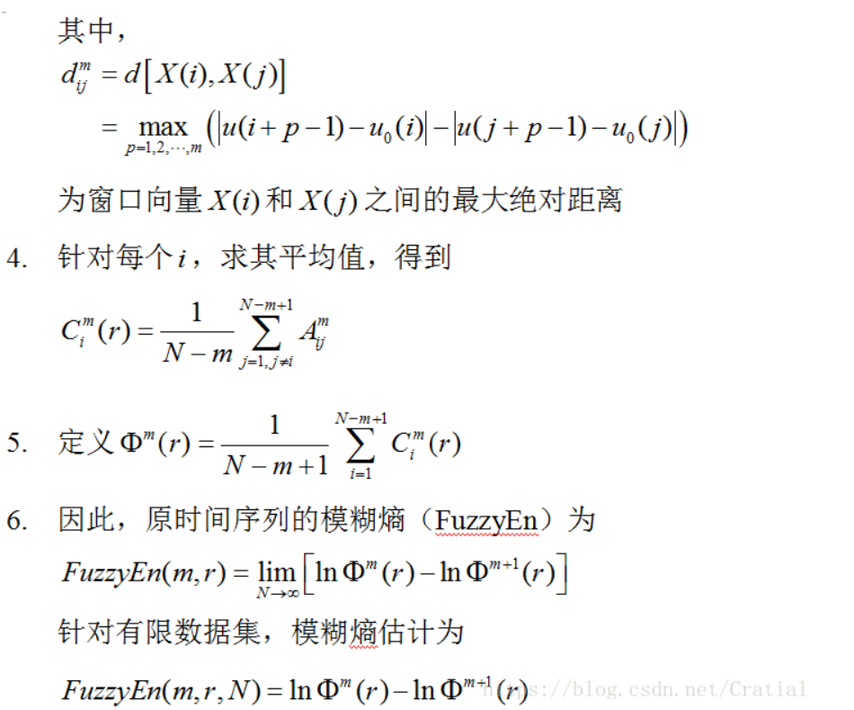

# 一、理论基础

与近似熵（ApEn）和样本熵（SampEn）的物理意义相似，模糊熵（FuzzyEn）衡量的也是新模式产生的概率大小，测度值越大，新模式产生的概率越大，即序列复杂度越大。

算法描述如下：





通常情况下，较大的m能更细致地重构系统的动态演化过程。相似容限r的取值也是一个值得考虑的问题，过大的相似容限会导致信息丢失，相似容限值越大，丢失的信息越多，而太小的相似容限度则会增加结果对噪声的敏感性，一般定义r为r*SD，其中SD(Standard Deviation)为原一维时间序列的标准差[1,2]。

# 二、代码实现

**matlab**

```matlab
function fuzzyen = Fuzzy_Entropy( dim, r, data, tau )
% FUZZYEN Fuzzy Entropy
%   calculates the fuzzy entropy of a given time series data

% Similarity definition based on vectors' shapes, together with the
% exclusion of self-matches, earns FuzzyEn stronger relative consistency
% and less dependence on data length.

%   dim     : embedded dimension 
%   r       : tolerance (typically 0.2 * std)
%   data    : time-series data
%   tau     : delay time for downsampling (user can omit this, in which case
%             the default value is 1)
%

if nargin < 4, tau = 1; end
if tau > 1, data = downsample(data, tau); end

N = length(data);
Phi = zeros(1,2);

for m = dim:dim+1
    
    Ci = zeros(1,N-m+1);
    dataMat = zeros(m,N-m+1);
    
    % setting up data matrix - form vectors
    for j = 1:m
        dataMat(j,:) = data(j:N-m+j);
    end
    
    % baseline
    U0 = mean(dataMat);
    % remove baseline and calculate the absolute values
    Sm = abs(dataMat - repmat(U0,m,1));
    
    % Given vector Si, calculate the similarity degree between its'
    % neighboring vector Sj
    for i = 1:N-m+1
        
        Sm_tmp = Sm;
        Sm_tmp(:,i) = []; % excluded self-matches
        % maximum absolute difference of the corresponding scalar components
        % of Si and Sj (j≠i)
        dij = max(repmat(Sm(:,i),1,N-m) - Sm_tmp);
        % similarity degree
        Aij = exp(-log(2)*(dij/r).^2);
        % averaging all the similarity degree of its neighboring vectors Sj
        Ci(i) = sum(Aij)/(N - m);
        
    end
    
    % summing over the counts
    Phi(m-dim+1) = sum(Ci)/(N-m+1); % φ_m and φ_m+1
    
end

fuzzyen = log(Phi(1))-log(Phi(2));  % fuzzyen = ln(φ_m)-ln(φ_m+1)

end
```

